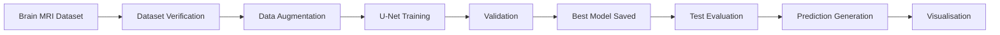
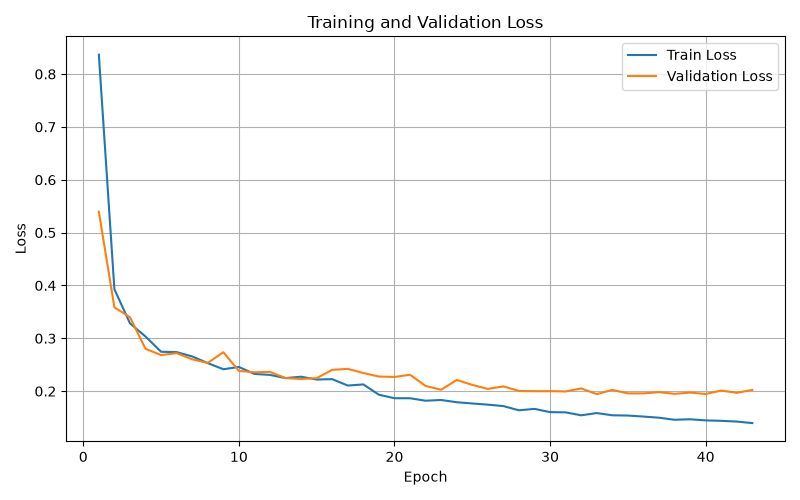
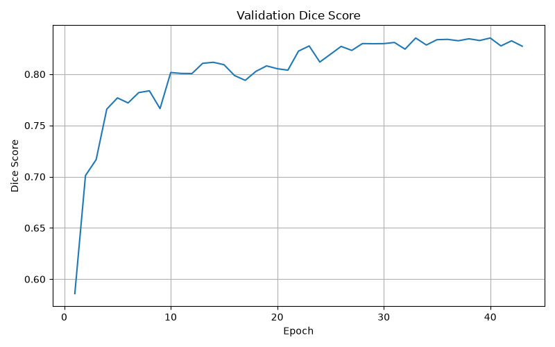
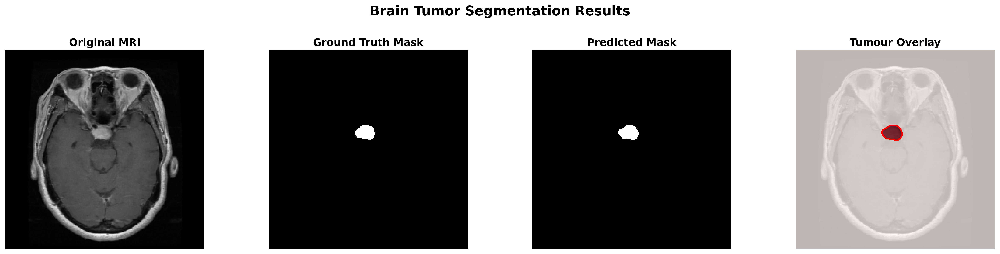
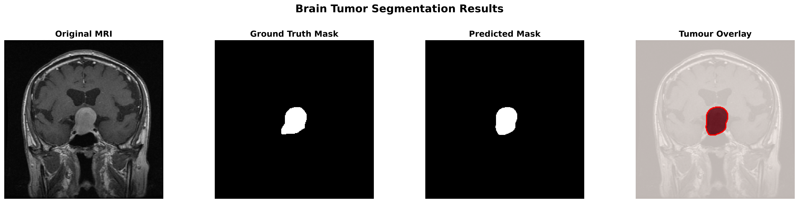
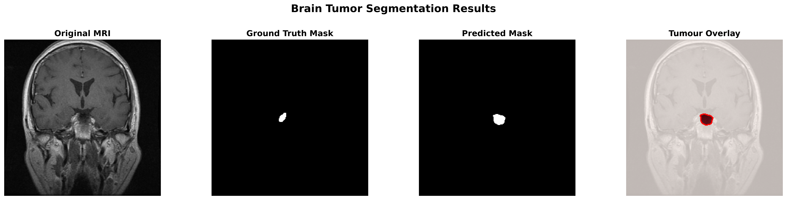

<div align="center">

# 🧠 Brain Tumor Segmentation using U-Net

### Deep Learning-based Semantic Segmentation of Brain MRI Images

<p>


</p>

A deep learning project that performs **automatic brain tumour segmentation** from MRI scans using a **U-Net architecture** with a **MobileNetV2 encoder**. The model accurately predicts tumour regions and produces segmentation masks that closely match expert annotations.

---

</div>

# 📖 Project Overview

Brain tumour segmentation is a critical task in medical image analysis. Accurate localisation of tumour tissue assists clinicians in diagnosis, treatment planning, and disease monitoring.

This project implements a semantic segmentation pipeline using **PyTorch** and **Segmentation Models PyTorch (SMP)** to identify tumour regions in grayscale MRI scans.

The workflow includes:

- Data verification
- Dataset preparation
- Data augmentation
- Model training
- Validation
- Performance evaluation
- Prediction visualisation
- Automatic checkpointing

---

# 🖼 Pipeline Overview

MRI Image
      │
      ▼
Data Preprocessing
      │
      ▼
Data Augmentation
      │
      ▼
U-Net (MobileNetV2 Encoder)
      │
      ▼
Predicted Tumour Mask
      │
      ▼
Performance Evaluation
      │
      ▼
Overlay Visualisation

---

# 🧠 Dataset

The dataset contains paired grayscale MRI brain images and manually annotated tumour masks.

| Property | Value |
|----------|-------|
| Task | Binary Semantic Segmentation |
| Image Type | Brain MRI |
| Image Size | 256 × 256 (training) |
| Channels | 1 (Grayscale) |
| Classes | Background, Tumour |
| Total Images | 3064 |

Each image has a corresponding binary mask where:

- **Black** → Background
- **White** → Tumour Region

---

# 🏗 Model Architecture

- U-Net
- MobileNetV2 Encoder
- ImageNet Pretrained Weights
- Binary Segmentation
- BCE + Dice Loss
- Adam Optimizer
- ReduceLROnPlateau Scheduler
- Early Stopping

---

# ⚙ Training Configuration

| Parameter | Value |
|-----------|------:|
| Epochs | 50 |
| Batch Size | 2 |
| Learning Rate | 0.0001 |
| Image Size | 256 × 256 |
| Optimizer | Adam |
| Early Stopping | 10 Epochs |
| Device | CPU / CUDA |

---

# 🔄 Project Workflow



---

# 📂 Project Structure

```text
brain-tumor-segmentation-unet/
│
├── data/
│   ├── train/
│   ├── val/
│   └── test/
│
├── models/
│   ├── best_model.pth
│   ├── last_model.pth
│   └── unet.py
│
├── outputs/
│   └── predictions/
│
├── reports/
│   ├── history.csv
│   ├── loss_curve.png
│   └── dice_curve.png
│
├── scripts/
│   ├── train.py
│   ├── evaluate.py
│   ├── predict.py
│   └── ...
│
├── utils/
│
├── requirements.txt
├── README.md
└── LICENSE
```

---

# 📈 Training Performance

| Metric | Score |
|---------|------:|
| Best Validation Dice | **0.8353** |
| Test Dice Score | **0.8030** |
| Test IoU Score | **0.7199** |
| Test Loss | **0.2270** |

---

# 📊 Training Curves

<p align="center">





</p>

---

# 🔬 Sample Predictions

The following examples compare the original MRI scan, the ground-truth tumour mask, the predicted segmentation mask, and the final tumour overlay.

<p align="center">



<br><br>



<br><br>



</p>

The prediction visualisation shows:

- Original MRI scan
- Ground-truth tumour mask
- Predicted segmentation mask
- Tumour overlay with contour

---

# 🚀 Installation

```bash
git clone https://github.com/only1jamjam-ctrl/brain-tumor-segmentation-unet.git

cd brain-tumor-segmentation-unet

python -m venv brain-env

brain-env\Scripts\activate

pip install -r requirements.txt
```

---

# ▶ Training

```bash
python scripts/train.py
```

---

# 📊 Evaluate

```bash
python scripts/evaluate.py
```

---

# 🔍 Generate Predictions

```bash
python scripts/predict.py
```

---

# 💡 Future Improvements

- Attention U-Net
- DeepLabV3+
- Dice + Focal Loss
- Mixed Precision Training
- ONNX Export
- Streamlit Web Application
- 3D MRI Volume Segmentation

---

# 📚 Technologies Used

- Python
- PyTorch
- Segmentation Models PyTorch
- OpenCV
- Albumentations
- NumPy
- Matplotlib
- Pandas

---

# 📜 License

This project is licensed under the MIT License.

---

<div align="center">

### ⭐ If you found this project useful, consider giving it a star.

</div>